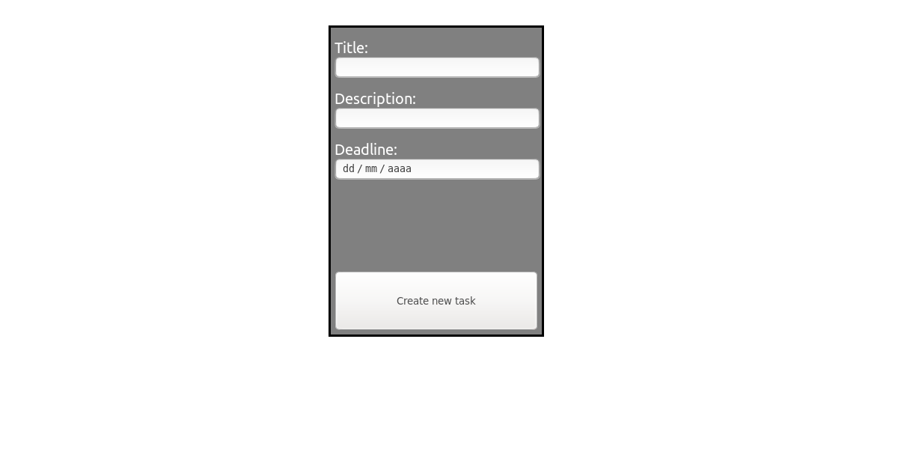

# :calendar: FlaskReact


[](https://www.codacy.com/manual/Markkop/FlaskReact?utm_source=github.com&utm_medium=referral&utm_content=Markkop/FlaskReact&utm_campaign=Badge_Grade)
[](https://reactjs.org/)


A To Do app made in React (JavaScript) and Flask (Python)

## How it works


- Demo link: <https://flaskreact.herokuapp.com/>
- Api link: <https://flaskreact-server.herokuapp.com/hello>

## How to develop

### App

Inside `app` folder:

```bash
yarn
yarn start
```

Make sure to change api's url to localhost when developing

### Server

Inside `server/src` folder:

```bash
pipenv install
export FLASK_APP=server/src
export FLASK_ENV=development
export FLASK_DEBUG=1`
flask init-db
flask run
```

## How to deploy via Heroku

```bash
heroku login
heroku create
git init
git remote add heroku <git>
git add .
git commit -m "deploy"
git push heroku master
```

## References

- [Building a Todo App with Flask in Python](https://stackabuse.com/building-a-todo-app-with-flask-in-python/)
- [Flask's Tutorial](https://flask.palletsprojects.com/en/1.0.x/tutorial/)

## v1 gif


